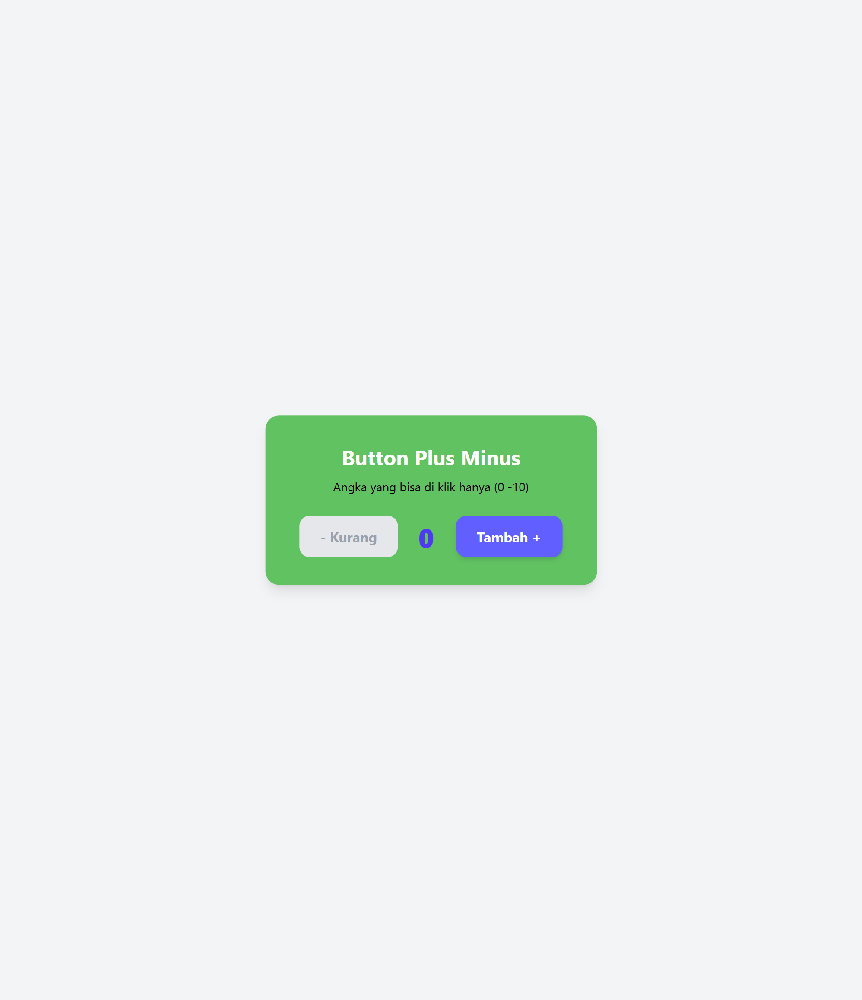

# preview Program

## Screenshot Program

## Demo Program

program ini merupakan preview memanfaatkan state pada react dimana kita set state dengan angka 0, lalu jika state > 0 maka tombol - akan mengurangi nilai state - 1,dan jika state < 10 maka tombol + akan Menambah nilai state + 1,

selain itu saya memanfaatkan fitur disable pada tombol - ketika state bernilai 0, dan disable pada tombol + ketika nilai state 10